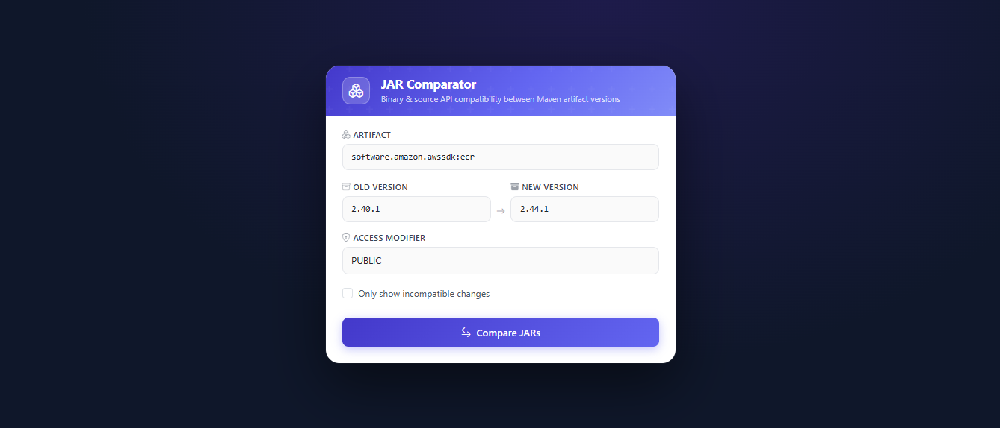
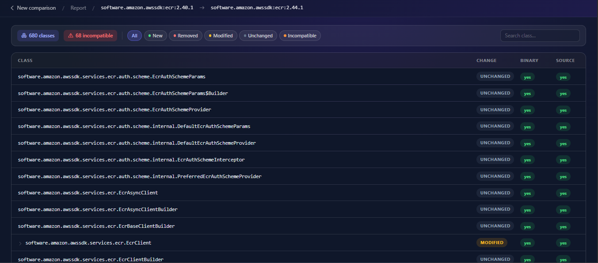
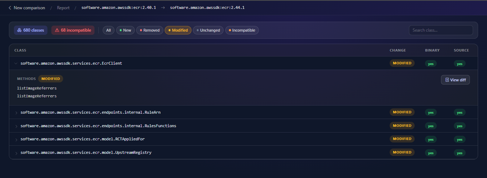
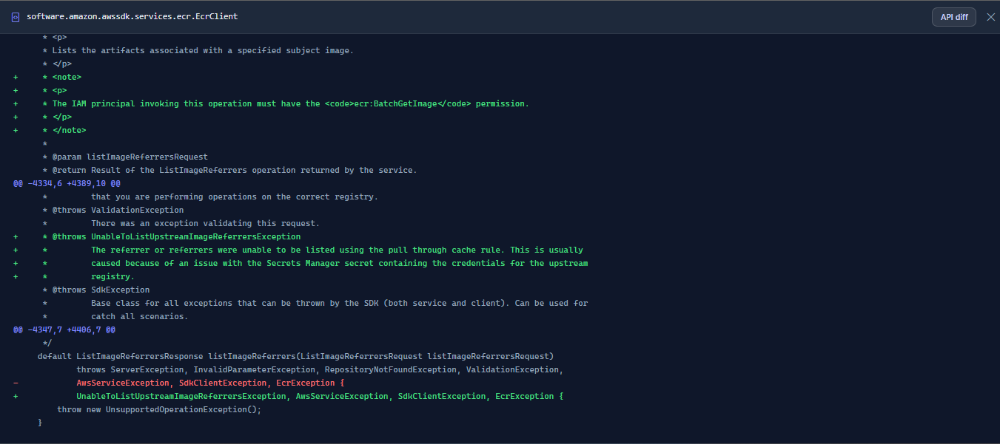

# jar-comparator

[](https://github.com/danielferraz-git/jar-comparator/actions/workflows/ci.yml)


Detect breaking API changes between two versions of any Maven artifact — in your browser or from the terminal.






## Features

- **Binary & source compatibility** — powered by [japicmp](https://github.com/siom79/japicmp), the same engine used by many major open-source projects
- **Web UI** — paste two Maven coordinates and get a filterable, searchable HTML report in seconds
- **CLI mode** — pipe the output into your CI scripts; exits with code `1` on any incompatibility
- **Source diff** — view unified diffs of changed class sources side-by-side in the report
- **Automatic download** — fetches JARs (and sources) directly from Maven Central; no local Maven repo needed

## Tech Stack

| Layer | Technology |
|---|---|
| Runtime | Java 25 + Quarkus 3.35 |
| CLI parsing | PicoCLI |
| REST / HTML | JAX-RS + Qute templates |
| Comparison engine | japicmp 0.25 |
| Diff generation | java-diff-utils 4.12 |
| Frontend | Bootstrap 5.3 |

## Getting Started

**Prerequisites:** Java 25, Maven 3.9+

```bash
git clone https://github.com/danielferraz-git/jar-comparator.git
cd jar-comparator
mvn package -q
```

### Web mode

```bash
java -jar target/jar-comparator-runner.jar
# Open http://localhost:8080
```

Enter two Maven coordinates (e.g. `com.google.guava:guava:31.0-jre` and `com.google.guava:guava:33.0.0-jre`) and click **Compare**.

### CLI mode

```bash
java -jar target/jar-comparator-runner.jar \
  --old-version com.google.guava:guava:31.0-jre \
  --new-version com.google.guava:guava:33.0.0-jre
```

Exit code `0` = fully compatible. Exit code `1` = breaking changes found.

#### Save an HTML report

```bash
java -jar target/jar-comparator-runner.jar \
  --old-version org.springframework:spring-core:5.3.39 \
  --new-version org.springframework:spring-core:6.2.6 \
  --output-html report.html
```

#### Additional options

| Flag | Default | Description |
|---|---|---|
| `--access-modifier` | `PUBLIC` | Minimum visibility to include (`PUBLIC`, `PROTECTED`, `PACKAGE`, `PRIVATE`) |
| `--ignore-missing-classes` | `false` | Skip classes not on the comparison classpath |
| `--only-incompatible` | `false` | Show only classes with breaking changes |
| `--output-html` | — | Write HTML report to this file |

## How It Works

```
Maven coordinates
      │
      ▼
MavenCentralDownloader  ──► repo1.maven.org (concurrent, cached)
      │
      ▼
JarComparisonService    ──► japicmp (binary + source analysis)
      │
      ▼
HtmlReportGenerator     ──► Qute template → HTML report
```

Both the web server and the CLI share the same service layer. The entry point (`Main.java`) selects the mode based on whether arguments are passed.

## License

MIT
